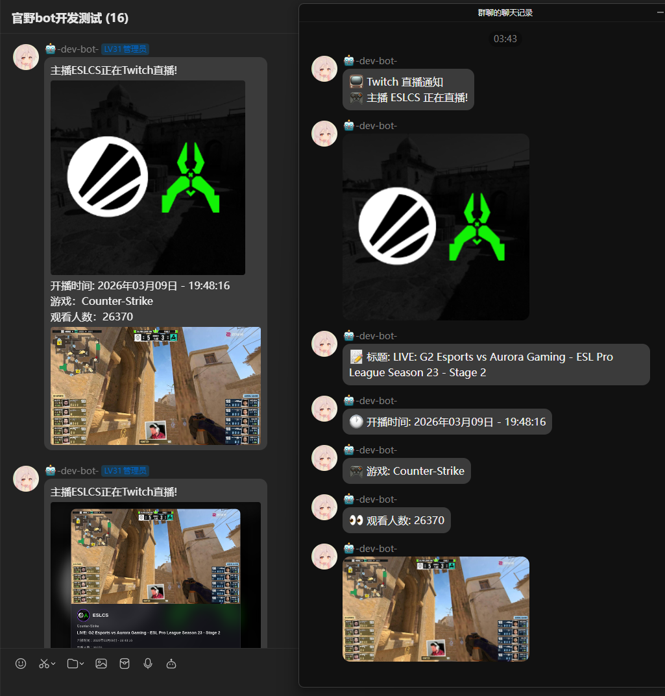
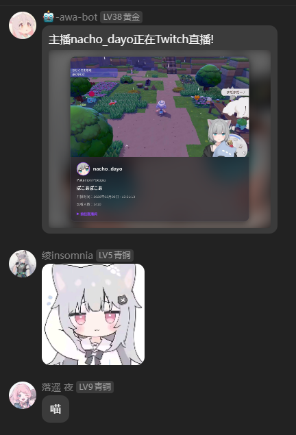
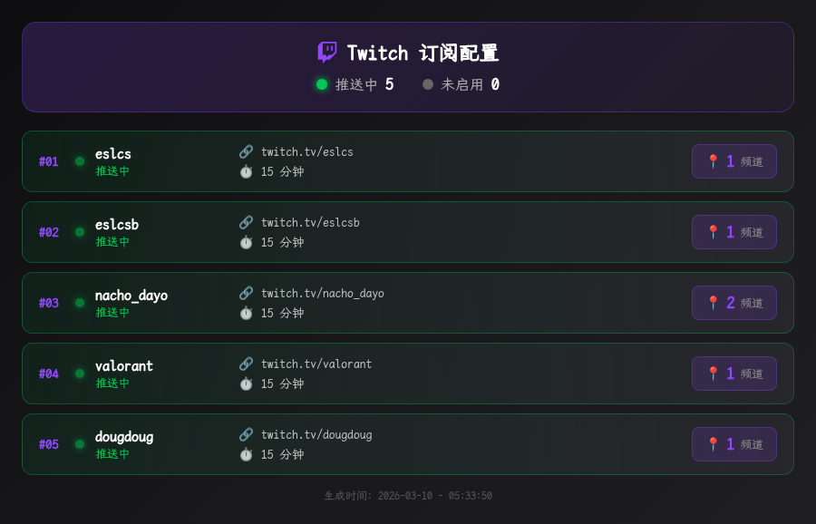
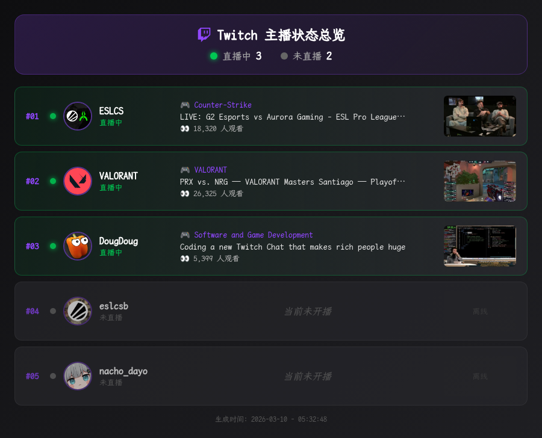

# koishi-plugin-twitch

[](https://www.npmjs.com/package/koishi-plugin-twitch)
[](https://www.npmjs.com/package/koishi-plugin-twitch)
[](https://github.com/VincentZyuApps/koishi-plugin-twitch)
[](https://gitee.com/vincent-zyu/koishi-plugin-twitch)

<p><del>💬 插件使用问题 / 🐛 Bug反馈 / 👨‍💻 插件开发交流，欢迎加入QQ群：<b>259248174</b>   🎉（这个群G了</del> </p> 
<p>💬 插件使用问题 / 🐛 Bug反馈 / 👨‍💻 插件开发交流，欢迎加入QQ群：<b>1085190201</b> 🎉</p>
<p>💡 在群里直接艾特我，回复的更快哦~ ✨</p>

---

📺 **Twitch 直播推送插件** - 订阅你喜欢的 Twitch 主播，开播时自动推送通知到 QQ 群！

## ✨ 功能特点

- 🔔 **开播提醒**：自动检测主播开播状态，第一时间推送通知
- 🎨 **多种消息格式**：支持纯文字、Puppeteer 渲染图片、原始图片、合并转发等多种形式
- 📋 **多主播订阅**：支持同时订阅多个主播，分别推送到不同的群
- 🌐 **代理支持**：支持 HTTP/HTTPS/SOCKS5 代理，解决网络问题
- ⏰ **定时轮询**：可自定义轮询间隔，灵活配置
- ⚡ **性能优化**：Token 缓存 + 批量查询，减少 API 调用
- 🔤 **自定义字体**：支持自定义字体路径，让图片更好看

## 📸 效果预览

### CS 比赛直播 - 图文/图片/合并转发三种效果展示


### 可爱甘城猫猫推送效果~


### tw.config 指令 - 查看订阅配置


### tw.all 指令 - 查看所有主播状态


## 📦 安装

在 Koishi 插件市场搜索并安装 `twitch`

或者使用命令行：
```bash
# npm
npm install koishi-plugin-twitch

# yarn
yarn add koishi-plugin-twitch
```

## ⚙️ 配置说明

### 🔑 获取 Twitch API 凭证

1. 前往 [Twitch 开发者控制台](https://dev.twitch.tv/console/apps) 注册应用
2. 获取 `Client ID` 和 `Client Secret`
3. 在插件配置中填入对应的值

### 📋 配置项一览

#### 💬 消息发送形式配置

| 配置项 | 说明 | 默认值 |
|:---|:---|:---|
| `defaultCheckUsername` | tw.check 默认查询的主播名 | `nacho_dayo` |
| `customFontPath` | 自定义字体文件绝对路径（留空使用默认字体） | - |
| `liveCheckMsgFormArr` | 开播检查/定时推送的消息格式 | `puppeteer_image` |
| `configPrintMsgFormArr` | tw.config 指令的消息格式 | `text` |
| `allStatusMsgFormArr` | tw.all 指令的消息格式 | `text` |
| `quoteWhenSend` | 发消息时带引用 | `true` |
| `localTimezoneOffset` | 本地时区偏移量 | `+8` |

#### 📺 Twitch API 配置

| 配置项 | 说明 | 默认值 |
|:---|:---|:---|
| `clientId` | Twitch API Client ID | - |
| `clientSecret` | Twitch API Client Secret | - |
| `secret` | 验证密钥（10-20位随机字符串） | - |
| `pollCron` | 轮询 Cron 表达式 | `0,30 * * * * *` |

#### ⚡ 性能优化配置

| 配置项 | 说明 | 默认值 |
|:---|:---|:---|
| `enableTokenCache` | 启用 Token 缓存 | `true` |
| `tokenCacheMinutes` | Token 缓存时间（分钟） | `50` |
| `enableBatchQuery` | 启用批量查询（减少 API 调用） | `true` |

### 📨 消息形式说明

- 📝 **text** - 纯文本，只发送文字信息
- 🎨 **puppeteer_image** - Puppeteer 渲染模板图，精美卡片样式
- 🖼️ **raw_image** - 原始头像+封面图，直接发送直播间图片
- 📦 **forward** - 合并转发，仅适用于 OneBot 平台

## 📖 使用方法

### 指令列表

```
tw                        # 查看帮助 / 根指令
tw.check [username]       # 查询主播直播状态（不填则查询默认主播）
tw.config                 # 查看当前订阅配置
tw.all                    # 查看所有订阅主播的状态
```

## 🌐 代理配置

由于 Twitch API 需要访问外网，如果网络不通，可以配置代理：

```yaml
proxy:
  enabled: true
  protocol: socks5  # 支持 http/https/socks4/socks5/socks5h
  host: 127.0.0.1
  port: 7890
```

## 📝 更新日志

### v0.1.0-beta.1 (2026-03-13)
- ♻️ **代码重构**：模块化拆分，代码更清晰易维护
- ✨ **新增指令**：`tw.config` 查看配置，`tw.all` 查看所有主播状态
- 🎨 **统一图片风格**：三个指令的 Puppeteer 渲染风格统一
- 🔤 **自定义字体**：支持配置自定义字体路径
- ⚡ **性能优化**：Token 缓存 + 批量查询，大幅减少 API 调用

### v0.0.5-beta.2 (2026-03-11)
- ⚡ Token 缓存 + 批量查询优化

### v0.0.4-alpha.2 (2026-02-08)
- ✨ 添加直播链接开关配置
- ✨ 新增 FORWARD 消息模式（OneBot 平台合并转发）

### v0.0.4-alpha.1 (2026-02-03)
- ✨ 拆分 IMAGE 为 PUPPETEER_IMAGE / RAW_IMAGE
- 🐛 修复重复推送问题

## 🏗️ 项目结构

```
src/
├── index.ts           # 入口文件、生命周期、定时任务
├── config.ts          # Schema 配置定义
├── types.ts           # 类型和常量定义
├── utils.ts           # 工具函数 + 共享状态
├── commandCheck.ts    # tw.check 指令
├── commandConfig.ts   # tw.config 指令
├── commandAll.ts      # tw.all 指令
├── renderCheck.ts     # tw.check 渲染逻辑
├── renderConfig.ts    # tw.config 渲染逻辑
└── renderAll.ts       # tw.all 渲染逻辑
```

## ⚠️ 注意事项

1. 需要安装 `puppeteer` 服务才能使用渲染图片功能
2. 合并转发功能仅支持 OneBot 平台
3. 建议配置代理以确保 API 访问稳定
4. 自定义字体支持 `.ttf`, `.otf`, `.woff`, `.woff2` 格式
